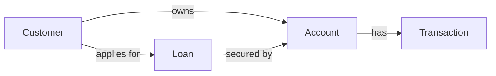
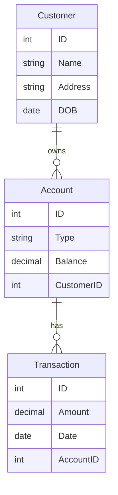
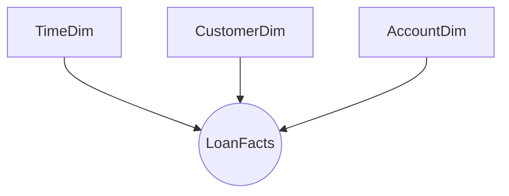

# Architectural Modelling: Foundations for Enterprise Data Platforms
Welcome to my **Data Modeling Portfolio**  repository! This project demonstrates how core data modeling concepts form the foundation for a successful enterprise data platform (EDP) in any business initiative. Using a banking use case (e.g., managing customer accounts, transactions, loans, and fraud detection), we'll explore data models from beginner to advanced levels. The goal is to show how these models support scalable, governed data environments for warehouses, lakehouses, AI projects, and more.

This documentation emphasizes:

- **Enterprise Data Modeling Lifecycle**: A process ensuring all new data initiatives consult the enterprise data model for consistency.
- **Governance Benefits:** How this approach enhances data quality, compliance, security, and AI readiness.
- **Tool Recommendations:** Practical tools for each stage.

Feel free to clone this repo, contribute, or use it as a template for your own projects. Diagrams are designed with mermaid (use Draw.io to recreate them). For real-world implementation, integrate with tools like Microsoft Purview for governance.

## Why Data Modeling is Foundational for Enterprise Data Platforms

Data modeling structures, connects, and governs enterprise data to improve analytics, compliance, and AI readiness. In a banking context, where data volumes are massive (e.g., millions of transactions daily), poor modeling leads to silos, errors, and regulatory risks (e.g., non-compliance with GDPR or Basel III).

### What is Data Modeling?

Data modeling is like blueprinting a house. It defines how data is organised, related, and used. It starts abstract (high-level ideas) and gets concrete (database specifics). Benefits include:

- **Consistency:** Ensures everyone (e.g., analysts, developers) speaks the same "data language."
- **Efficiency:** Reduces redundancy, like avoiding duplicate customer records in a bank.
- **Scalability:** Supports growth, e.g., adding AI for fraud detection without rebuilding everything.

### Role in Business Initiatives
In an EDP, data models act as a "single source of truth." For a bank, this means integrating data from branches, online banking, and ATMs into a unified view. Models help in:

- **Data Warehouses/Lakehouses:** Storing historical data for reporting (e.g., quarterly loan performance).
- **AI Projects:** Providing clean, structured data for models (e.g., predicting loan defaults using customer history).

### Integration with Modern Architectures
Advanced modeling incorporates semantics, lineage, and automation. In banking, use Data Vault for auditability (e.g., tracking transaction changes for anti-money laundering). Models enable AI governance by ensuring data provenance, critical for explainable AI in credit scoring.

## Enterprise Data Modeling Lifecycle
To ensure new initiatives (e.g., a new AI fraud detection system) align with the EDP, follow this lifecycle. It mandates consulting the enterprise data model early, reducing silos and risks.

1. **Discovery & Consultation (Conceptual Phase):**
- Identify business needs (e.g., "We need better customer 360° views for cross-selling loans").
- Consult the enterprise conceptual model to reuse entities (e.g., "Customer" already defined).
- Tool: Draw.io for quick sketches; Confluence for collaborative brainstorming.

2. **Design & Alignment (Logical Phase):**
- Refine relationships and attributes.
- Validate against enterprise standards (e.g., ensure "Account" links to "Transaction" consistently).
- Governance Check: Review for compliance (e.g., PII masking for GDPR).
- Tool: ERwin Data Modeler for logical diagramming.

3. **Implementation (Physical/Dimensional/Data Vault Phase):**
- Build database schemas or vaults.
- Integrate with EDP (e.g., load into a lakehouse).
- Tool: Informatica MDM for master data (e.g., golden customer records).

5. **Deployment & Monitoring:**
- Deploy to production (e.g., Azure Synapse for banking analytics).
- Track lineage and quality.
- Tool: Microsoft Purview for cataloging, lineage, and governance audits.

6. **Iteration & Governance Review:**
- Post-launch, update the enterprise model.
- Mandate this lifecycle in policies—e.g., no new project approval without model review.

This lifecycle cuts development time by 25-40% (per industry benchmarks) by reusing assets.

## Governance Benefits of This Approach

Enterprise data modeling enforces governance, turning data chaos into trusted assets. In banking:

- **Data Quality & Trust:** Models eliminate duplicates (e.g., one "Customer" entity), improving AI accuracy (e.g., 50% better fraud detection).
- **Compliance & Risk Reduction:** Lineage tracking (via Purview) ensures audit trails for regulators (e.g., FCA/PRIIPs).
- **AI Readiness:** Governed models provide clean inputs, reducing bias in AI (e.g., fair loan approvals).
- **Cost Savings:** Avoid sprawl; e.g., 40% lower storage in warehouses.
- **Collaboration:** Centralized models foster cross-team alignment (e.g., finance and IT sharing loan data).

Overall, it builds a "data fabric" for scalable, secure initiatives.

## Tool Recommendations

- **Draw.io (diagrams.net):** Free for ER diagrams; integrate with GitHub/Confluence. Great for beginners sketching conceptual models.
- **Confluence:** Collaborative docs; embed Draw.io diagrams for live updates. Use for lifecycle workflows.
- **ERwin Data Modeler:** Advanced for conceptual/logical/physical modeling; integrates with governance tools. Supports banking standards like FIBO ontology.
- **Informatica MDM:** For master data; handles multidomain (e.g., customers/products); integrates with IDMC for AI pipelines.
- **Microsoft Purview:** Unified governance; catalogs models, tracks lineage. Ideal for Azure-based banking EDPs.

## Banking Use Case: Modeling a Bank's Core Data Environment
Imagine a bank managing customers, accounts, transactions, and loans. We'll model this across types.

1. **Conceptual Model (Beginner: High-Level Overview)**
Abstract view of business entities and relationships. No tech details.
### Banking Example:
- Entities: Customer, Account, Transaction, Loan.
- Relationships: A Customer "owns" Accounts; Accounts "have" Transactions; Loans "link to" Accounts.

<!-- Text Diagram (Recreate in Draw.io):
<!-- textCustomer -- owns --> Account -- has --> Transaction
%%  Customer -- applies for --> Loan -- secured by --> Account 

Intermediate/Advanced: Adds business rules (e.g., "A Customer must have at least one Account"). Supports governance by defining core concepts reusable in AI (e.g., customer segmentation).

2. **Logical Model (Intermediate: Structured Details)**
Adds attributes, keys, and constraints. Platform-agnostic.
Banking Example:

- Customer: ID (PK), Name, Address, DOB.
- Account: ID (PK), Type (Checking/Savings), Balance, CustomerID (FK).
- Relationships: One-to-Many (Customer to Accounts).

<!--Text Diagram:
textCustomer (ID, Name, Address, DOB) --1:N--> Account (ID, Type, Balance, CustomerID)
Account --1:N--> Transaction (ID, Amount, Date, AccountID) -->

Advanced: Includes normalization (e.g., 3NF) for integrity; governs data flows in warehouses.

3. **Physical Model (Advanced: Implementation-Ready)**
Database-specific: Tables, columns, indexes, data types.
Banking Example (SQL-like):

- Table: Customers (CustomerID INT PK, FullName VARCHAR(100), Address TEXT, DOB DATE).
- Indexes: On CustomerID for fast queries.
- Constraints: Balance >= 0.

Governance: Enforces security (e.g., encrypted columns for PII).

4. **Dimensional Model (Star Schema) (Intermediate: Analytics-Focused)**
For warehouses; facts (measures) and dimensions (descriptions).
Banking Example (Loan Analysis):

- Fact Table: LoanFacts (LoanID, CustomerID, Amount, InterestRate, ApprovalDate).
- Dimension Tables: CustomerDim (CustomerID, Name, CreditScore), TimeDim (Date, Month, Year).

<!-- Text Star Schema:
textTimeDim
             |
LoanFacts <-- CustomerDim
             |
           AccountDim -->

Advanced: Optimizes queries (e.g., OLAP for fraud trends); governs BI reports.

5. **Data Vault Model (Advanced: Scalable, Auditable)**
Hubs (entities), Links (relationships), Satellites (attributes). Ideal for banking audits.
Banking Example:

- Hub: Customer_Hub (CustomerHashKey, LoadDate, Source).
- Link: Customer_Account_Link (LinkHashKey, CustomerHashKey, AccountHashKey).
- Satellite: Customer_Sat (CustomerHashKey, Name, Address, EffectiveDate).

**Benefits:** Handles changes (e.g., address updates) with history; governs compliance (e.g., transaction audits for AML).
