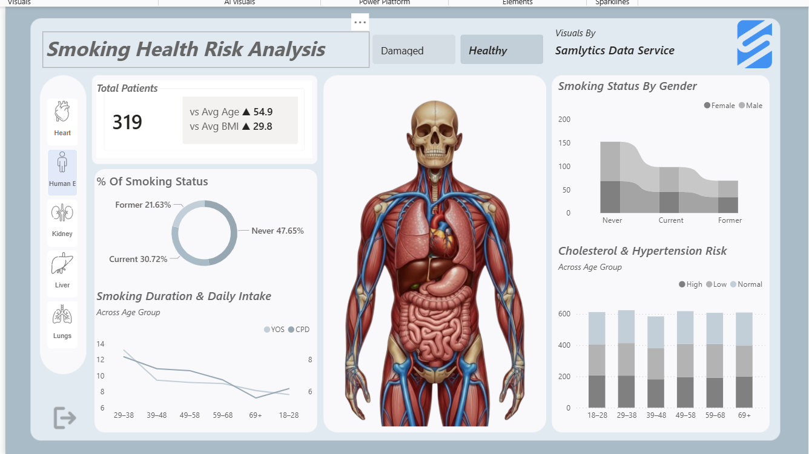

# 🏥 Smoking Health Risk Analytics Dashboard: Turning Data into Actionable Public Health & Business Insights

This Project is an **interactive Power BI healthcare dashboard** designed to analyze the **health risks associated with smoking** through a simulated dataset of 2,500 patients. 
Designed with a sleek, healthcare-inspired UI, it dynamically visualizes how smoking impacts major organs (**Heart**, **Lungs**, **Liver**, **Kidney**, and **overall Human Body**),it helps users explore how smoking behavior relates to **organ damage**, **smoking duration**, **daily cigarette intake**, and key health indicators such as **BMI, cholesterol level, and blood pressure risk**,switching between **Healthy vs Damaged** states using real organ images for immediate visual impact.

This project showcases end-to-end data analytics skills while delivering real-world insights that go beyond awareness: they highlight opportunities for targeted interventions in public health, insurance risk modeling, corporate wellness programs, and healthcare policy.


## Objectives
- Visualize smoking patterns across different groups
- Understand health risk indicators linked with smoking
- Provide an intuitive organ-based view of healthy vs damaged conditions
- Demonstrate end-to-end Power BI skills: data prep → modeling → DAX → storytelling

## Project Highlights
- **Interactive Exploration:** Users filter by organ condition (Healthy vs. Damaged) to see instant changes in visuals, including a central anatomical illustration.
- **Key Metrics:** Total patients, contextual average age (vs. overall 54.9), and BMI (vs. overall 29.8).
- **Visual Storytelling:** Donut charts for smoking status, line charts for smoking intensity by age, stacked bars for gender and risk profiles.
- Built with **Power BI, Power Query** for data transformation, **DAX** measures/columns, and custom visuals like **Chiclet Slicers**.

## Datasets Used
This project uses four datasets (CSV files):

- **health_dataset.csv** – patient demographics + smoking habits + health metrics  
- **condition.csv** – condition labels (Healthy / Damaged)  
- **Organs.csv** – list of organs used in the dashboard  
- **Image Dataset.csv** – image URLs for organ visuals (healthy/damaged)

## Dataset Overview
- **Total Records:** 2,500 patients  
- **Average Age:** 54.0 years  
- **Average BMI:** 29.6 (borderline obese)

The population represents a **high-risk demographic**, where smoking acts as a strong compounding factor for long-term health outcomes.

## Data Modeling & Logic
### Measures (DAX)
- Average Age (DAX Measure)
  
```
vs Avg Age = 
VAR _CurrentAge = AVERAGE(health_dataset[Age])
VAR _OverallAge = CALCULATE(AVERAGE(health_dataset[Age]), ALL(health_dataset))
VAR _Diff = _CurrentAge - _OverallAge

RETURN
SWITCH(
    TRUE(),
    _Diff > 0, UNICHAR(9650) & " " & FORMAT(_CurrentAge, "0.0"),
    _Diff < 0, UNICHAR(9660) & " " & FORMAT(_CurrentAge, "0.0"),
    FORMAT(_CurrentAge, "0.0")
)
```

- Average BMI (DAX Measure)
```
vs Avg BMI = 
VAR _CurrentBMI = AVERAGE(health_dataset[BMI])
VAR _OverallBMI = CALCULATE(AVERAGE(health_dataset[BMI]), ALL(health_dataset))
VAR _Diff = _CurrentBMI - _OverallBMI

RETURN
SWITCH(
    TRUE(),
    _Diff > 0, UNICHAR(9650) & " " & FORMAT(_CurrentBMI, "0.0"),
    _Diff < 0, UNICHAR(9660) & " " & FORMAT(_CurrentBMI, "0.0"),
    FORMAT(_CurrentBMI, "0.0")
)
```

- Age Group (DAX Column)
```
Age Group = 
SWITCH(
    TRUE(),
    health_dataset[Age] <= 28, "18–28",
    health_dataset[Age] <= 38, "29–38",
    health_dataset[Age] <= 48, "39–48",
    health_dataset[Age] <= 58, "49–58",
    health_dataset[Age] <= 68, "59–68",
    "69+"
)
```

- Total Patients (count of Patient ID)

## Tools & Technologies
- **Power BI Desktop**
- **Power Query** (data cleaning & transformation)
- **DAX** (measures & calculated columns)
- **Chiclet Slicer (Custom Visual)** for image-based filtering

## Powerful Business & Health Insights
 
<div align="center">
  
</div>

🔗 **[View the interactive Power BI dashboard](https://app.powerbi.com/view?r=eyJrIjoiYTYwZjkxZmMtYjkyNC00MTIxLTk0ZTAtN2NkN2VkYmM4NjhiIiwidCI6IjVlZGQyZmE1LTYxNDYtNDU4My1hMWIzLTM5NmNlNjdjNTI1YiIsImMiOjF9)**


### Smoking Prevalence is Alarmingly High — A Majority Risk Factor
Over **54.6%** of patients have smoked at some point (29.3% current + 25.2% former).
**Actionable Implication:** Smoking isn't a niche issue, it affects the **majority**. For **health insurers**, this means elevated long-term claims risk across most policyholders. Opportunity: Develop **smoking-cessation incentives** or tiered premiums to reduce payouts.

### Population Health Baseline
The dataset reflects an aging population with elevated BMI levels, placing many individuals at **increased baseline health risk**. This makes smoking behavior especially critical when assessing long-term damage.

### Smoking Status Distribution
| Smoking Status | Percentage |
|----------------|------------|
| Never Smoked   | 45.4% |
| Current Smokers | 29.3% |
| Former Smokers | 25.2% |

**Insight:**  
Over **54% of patients** have a history of smoking, indicating that smoking-related health risks affect the **majority** of the population rather than a small subgroup.

### Escalating Intensity Over Time
- Strong correlation **(0.73)** between years of smoking and daily cigarettes.

**Insight:**  
Smoking behavior intensifies over time. Individuals who smoke longer also tend to smoke **more cigarettes per day**, compounding health risks instead of stabilizing them.
**Actionable Implication:** Habits worsen, not plateau. Early intervention is critical. Corporate wellness programs can prioritise screening for younger employees (18–38) showing early signs, preventing escalation and reducing absenteeism/productivity loss.

### Gender-Neutral Risk
Smoking behavior is **balanced across genders** with a distribution that is nearly identical across genders.

| Smoking Status | Female | Male |
|----------------|--------|------|
| Current Smokers | 359 | 374 |
| Former Smokers | 312 | 319 |
| Never Smoked   | 567 | 569 |

 **Insight:** Smoking is not gender-skewed, suggesting prevention and intervention strategies should be **population-wide**, not gender-specific.
**Actionable Implication:** No need for gender-specific targeting — implement **universal screening and cessation support** in workplaces, clinics, or insurance plans for maximum ROI.

### Organ Health Impact (Core Insight)
| Condition | Count | Percentage |
|---------|-------|------------|
| Healthy | 1,603 | 64.1% |
| Damaged | 897 | 35.9% |

**Insight:**  
More than **1 in 3 patients** show evidence of **organ damage**, highlighting the tangible health impact of smoking exposure.

#### Systemic Damage: Smoking Harms Far Beyond the Lungs
35.9% of patients show organ damage — more than 1 in 3.
| Organ | % Damaged |
|-----  |-----------|
| Liver | 37.7% |
| Kidney | 37.0% |
| Heart | 36.5% |
| Lungs | 35.1% |
| Human Body (Overall) | 32.7% |

**Insight:** While lung damage is expected, the **liver, kidney, and heart** show equal or higher damage rates, reinforcing that smoking causes **systemic, whole-body harm**, not just respiratory issues.
**Actionable Implication:** Damage is **whole-body systemic**, not just respiratory. Public health campaigns should shift messaging from "lung cancer" to **multi-organ failure** (e.g., liver/kidney/heart disease). For **pharma & wellness companies:** Target broader prevention tools (e.g., combined cardio-renal-metabolic programs).

### Hidden Cardiovascular Risks
Cholesterol levels remain elevated (~207–208 mg/dL) regardless of blood pressure risk category.
| BP Risk | Avg Cholesterol |
|------- |-----------------|
| Low    | 207.3 |
| Normal | 208.6 |
| High   | 206.5 |

**Insight:**  
Even patients with **normal blood pressure** show elevated cholesterol levels, revealing **hidden cardiovascular risk** not always visible through BP alone.
**Actionable Implication:** BP alone underestimates risk. Healthcare providers and insurers should mandate **combined lipid + BP monitoring**, especially for smokers, to catch "silent" progression early.

### Age-Driven Compounding Effect

- Smoking exposure increases with age
- Older age groups show:
  - Higher smoking duration
  - Higher daily intake
  - Greater cardiovascular and metabolic risk

 **Insight:**  
Smoking damage is **progressive**, compounding across decades rather than appearing immediately.
**Actionable Implication:** Focus resources on mid-life (40–60) interventions where damage accelerates — prime window for smoking cessation to yield the highest health ROI.

## Why This Matters for Business ##

- **Insurance Companies:** Quantify smoking as a multiplier for multi-organ claims → refine actuarial models.
- **Employers & Wellness Providers:** Justify investment in cessation programs with clear ROI (reduced healthcare costs, higher productivity).
- **Public Health & NGOs:** Evidence-based messaging to drive policy change and funding.
- **Data Analytics Professionals:** Demonstrates how visuals + dynamic images make complex health data accessible and persuasive.

## Dashboard Features
- Interactive **organ image slicers** (Healthy vs Damaged)
- KPI cards: Total Patients, Average Age, Average BMI
- Donut chart for smoking status distribution
- Line chart: Smoking duration vs daily intake by age group
- Stacked/ribbon charts for gender and risk analysis
- Clean healthcare-themed UI with custom background

## 🛠 Tools & Technologies
- **Power BI Desktop**
- **Power Query**
- **DAX (Measures & Calculated Columns)**
- **Chiclet Slicer (Custom Visual)**

  
## 🔗 Connect & Learn More

Let’s stay in touch and keep learning together!

[](https://www.linkedin.com/in/samlytics-data-service-487a7728a/)
[](https://www.instagram.com/samlytics_data/saved/)
[](https://www.youtube.com/@samlytics)

⭐ **Found this helpful?** Star the repo and share with developers interested in data & AI!

**Tags**: `first-Analytics-project` `data-Visualisation` `PowerBI` `DAX` `Image_URL` `tutorial` `beginner-friendly`
