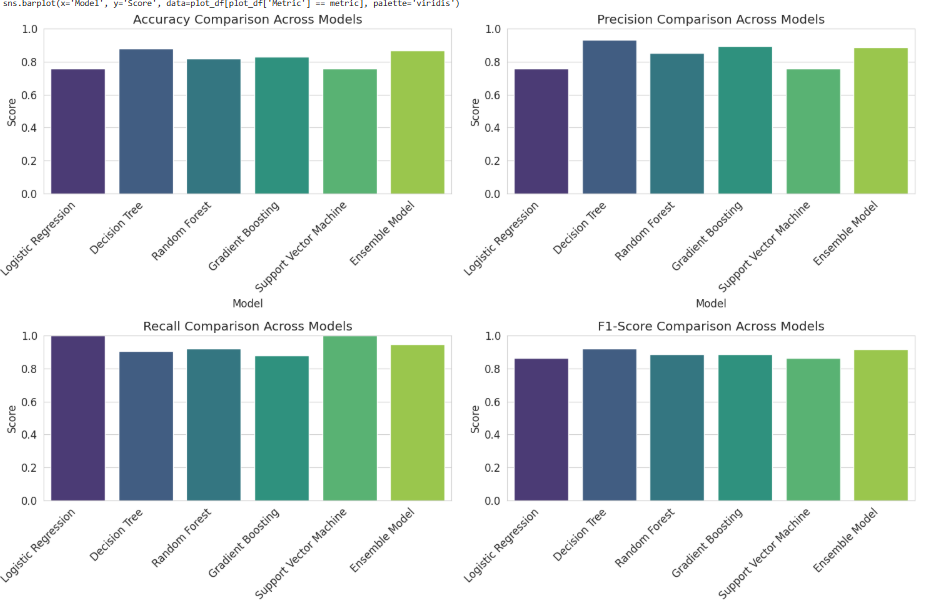
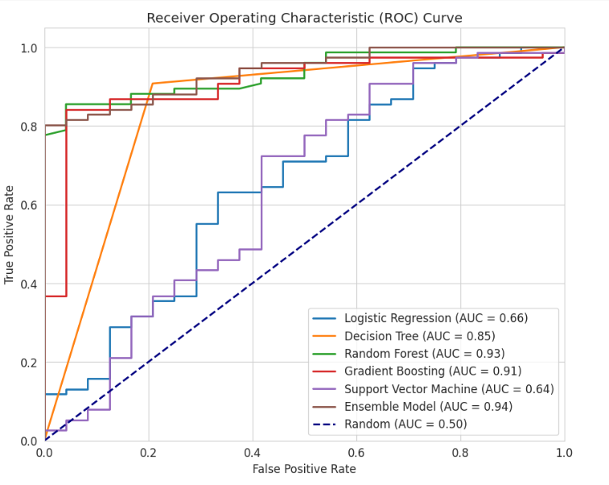

# 🏦 CreditSense AI: Automated Loan Approval & Risk Assessment 🚀

[](https://github.com/your-username/your-repo-name)
[](https://github.com/your-username/your-repo-name/fork)
[](https://opensource.org/licenses/MIT)

---

## ✨ Project Overview

This project showcases a machine learning-driven solution designed to **streamline the loan approval process** and enhance overall **loan management** for financial institutions. By leveraging historical customer data, we aim to build robust predictive models that can accurately assess creditworthiness, automate approval decisions, and provide insights for risk mitigation.

---

## 🎯 Key Features

* **Realistic Synthetic Data Generation**: 📊 Creates a comprehensive dataset simulating customer loan requests, disbursements, and repayment statuses.

* **Automated Loan Approval Prediction**: 🤖 Develops and evaluates machine learning models to predict loan approval status.

* **Ensemble Modeling**: 🤝 Implements an ensemble model to potentially boost predictive performance beyond individual classifiers.

* **Performance Comparison**: 📈 Provides a clear comparison of various model performances to identify the most effective solution.

* **Scalable & Adaptable**: Designed with a modular approach, allowing for easy integration and adaptation to real-world scenarios.

---

## 🚀 Dataset Description

The core of this project is a synthetically generated dataset of **500 loan applications**. Each entry includes critical features for credit assessment:

* `loan_id`, `customer_id`

* `loan_amount` (in thousands)

* `loan_term_months` (up to 60 months/5 years)

* `interest_rate`

* `credit_score`

* `income`

* `debt_to_income_ratio`

* `loan_purpose`

* `employment_status`

* `application_date`, `approval_status`, `disbursement_date`

* `first_repayment_date`, `scheduled_repayment_amount`, `total_repaid_amount`

* `repayment_status`, `number_of_late_payments`, `last_payment_date`

The `approval_status` is the target variable, simulated based on realistic creditworthiness criteria.

---

## 🧠 Machine Learning Models

We explore both individual and ensemble approaches for predicting loan approval:

### Individual Models:

1.  **Logistic Regression**: A foundational, interpretable model for binary classification.

2.  **Decision Tree**: Simple, rule-based, and easy to visualize.

3.  **Random Forest**: An ensemble of decision trees, known for high accuracy and robustness.

4.  **Gradient Boosting (GradientBoostingClassifier)**: Powerful sequential ensemble method that builds upon the errors of previous models.

5.  **Support Vector Machine (SVC)**: Effective for complex, non-linear classification tasks.

### Ensemble Model:

* **VotingClassifier (Soft Voting)**: Combines the predictions of the five individual models by averaging their predicted probabilities, aiming for improved generalization and stability.

---

## 📊 Performance Comparison

The project performs a rigorous comparison of all trained models. The dataset is split into an **80% training set** and a **20% testing set** to evaluate generalization capabilities.

Key metrics used for comparison include:

* **Accuracy**: Overall correctness of predictions.

* **Precision**: Proportion of positive identifications that were actually correct.

* **Recall**: Proportion of actual positives that were identified correctly.

* **F1-Score**: Harmonic mean of precision and recall.

* **ROC AUC**: Measures the area under the Receiver Operating Characteristic curve, indicating the model's ability to distinguish between classes.

The results are presented in a clear tabular format, highlighting the strengths and weaknesses of each model.

### 📈 Visualizing Model Performance

To provide a more intuitive understanding of model strengths, the performance metrics for each classifier (individual and ensemble) can be visualized. This typically involves:

* **Bar Charts**: Comparing Accuracy, Precision, Recall, and F1-Score across all models using individual bar charts for each metric. This allows for quick identification of the top-performing models in specific areas.
  

These bar charts provide a direct visual comparison of Accuracy, Precision, Recall, and F1-Score for each model.
They quickly highlight which models excel in specific performance areas, offering insights into their strengths and weaknesses relative to each other and the ensemble.
For instance, a model with high Recall might be good at identifying most 'Approved' loans, while high Precision indicates fewer false 'Approved' predictions.

* **ROC Curves**: Plotting the Receiver Operating Characteristic (ROC) curve for each model. The Area Under the Curve (AUC) provides a single metric to compare overall discriminative power, where a higher AUC indicates better performance.

The ROC curve illustrates the trade-off between the True Positive Rate (TPR) and False Positive Rate (FPR) at various threshold settings.
The Area Under the Curve (AUC) is a crucial single metric: closer to 1.0 indicates a better ability to distinguish between positive and negative classes (Approved vs. Rejected loans).
Models with curves closer to the top-left corner and higher AUC values are generally considered more effective at classifying loan approvals.

These visualizations provide an at-a- glance overview, making it easier to compare and select the most suitable model for the loan approval system based on specific business objectives (e.g., prioritizing recall to minimize missed approvals, or precision to minimize false approvals).

---

## 🛠️ Setup and Usage

To run this project locally, follow these steps:

1.  **Clone the repository (if applicable):**
    ```bash
    git clone [https://github.com/your-username/your-repo-name.git](https://github.com/your-username/your-repo-name.git)
    cd your-repo-name
    ```
2.  **Install dependencies:**
    ```bash
    pip install pandas numpy scikit-learn Faker
    ```
3.  **Run the Python script:**
    ```bash
    python your_script_name.py # (e.g., main.py or loan_predictor.py)
    ```

The script will generate the dataset, train the models, and print the performance comparison to your console.

---

## 📈 Future Enhancements

* **Hyperparameter Tuning**: Optimize model performance using techniques like Grid Search or Random Search.

* **Feature Engineering**: Explore creating more sophisticated features from the existing data.

* **Cross-Validation**: Implement k-fold cross-validation for more robust model evaluation.

* **Explainable AI (XAI)**: Integrate tools to understand model predictions (e.g., SHAP, LIME).

* **Deployment**: Develop a simple web interface for real-time loan approval predictions.

* **Real-world Data Integration**: Adapt the framework to work with actual bank loan datasets (with proper anonymization and security).

---

## 👋 Contact

For any questions or collaborations, please feel free to reach out to [Oluwaseun Odeyemi/samsonoluwaseun65@gmail.com/[LinkedIn](https://www.linkedin.com/in/oluwaseun-o-odeyemi/)].

---

**Developed with ❤️ by [Oluwaseun Odeyemi]**
