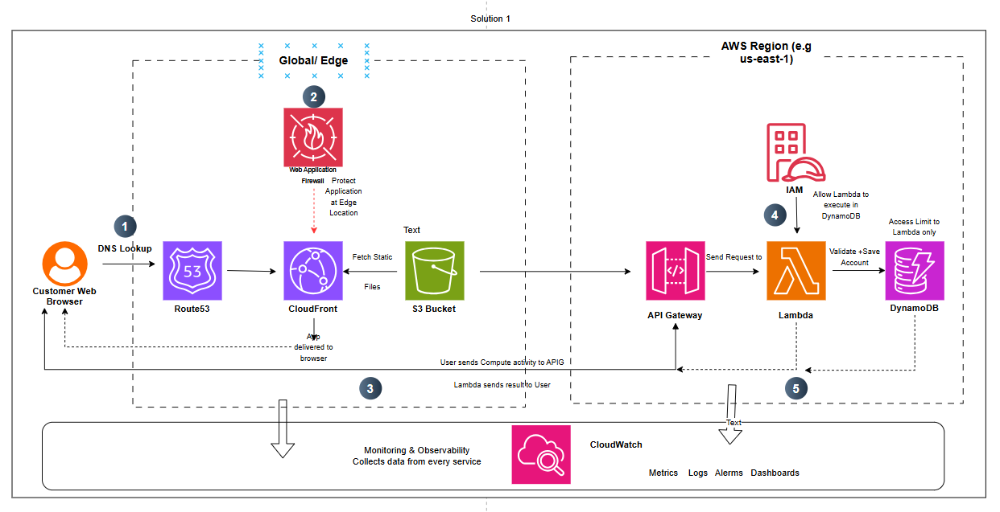

# AWS Serverless Startup Scaling Solution

> **Scenario:** A startup on a single EC2 instance is expecting traffic to jump from 1,000 to 100,000 users over a campaign weekend. The architecture needs to handle the spike and cost close to nothing when traffic is quiet.

---

## The Problem

The original setup is a single EC2 instance handling everything: serving files, running application code, and connecting to a database. That works at 1,000 users. It will not work at 100,000.

Two things will fail simultaneously:

1. **It cannot scale.** A single server has a fixed capacity. When that ceiling is hit, requests fail. There is no automatic way to add more.
2. **It cannot adapt its cost.** Whether 10 users visit or zero, the EC2 instance runs and charges the same amount. A startup with a tight budget cannot sustain idle infrastructure.

The goal is an architecture that scales up automatically during the spike, scales back down to near-zero when the campaign ends, and only charges for what it actually uses.

---

## Architecture Overview

The solution separates the application into distinct layers, each solved by the right AWS service for that specific job.

| Layer | Problem | AWS Services |
|-------|---------|-------------|
| Traffic | Routing, static content delivery, edge protection | Route 53, CloudFront, S3, WAF |
| Compute | Processing user actions at any scale | API Gateway, Lambda |
| Data | Storing and retrieving user data | DynamoDB |
| Security | Controlling who can do what | IAM |
| Cost | Pay only for actual usage | On-demand pricing across all services |
| Observability | Knowing the system is healthy | CloudWatch |

---

## Architecture Diagram

*Full annotated diagram showing the numbered request flow from browser to DynamoDB, including edge services, compute layer, IAM controls, and CloudWatch observability.*

---

## The AWS Decision Stack

The Decision Stack is a way of thinking through any architecture problem by asking six questions in order. Each question surfaces a different risk or constraint, and each answer leads you to the right service or trade-off for that layer.

---

### 1. Traffic

**The question:** How does data get to the user, how do you deliver it fast, and how do you protect the front door?

**What was chosen: Route 53 + CloudFront + S3 + WAF**

**Why Route 53?**

Every request starts with DNS. When a user types the application URL, their browser needs to find the IP address it points to. Route 53 is AWS's managed DNS service. It replaces the original setup where the domain pointed directly at the single EC2 instance. Now it points at CloudFront instead. That single change is what makes the rest of the architecture possible.

**Why CloudFront?**

CloudFront is a Content Delivery Network (CDN). It sits in front of everything and operates from over 400 Edge Locations around the world, not just from a single AWS Region. When a user in Lagos requests the application, they hit a nearby Edge Location rather than a server in us-east-1.

The key mechanism: the first time someone requests a file, CloudFront checks the Edge Location. If the file is not there, it fetches it from the origin (S3 in this case), serves it, and keeps a copy. Every subsequent request for that same file is served directly from the Edge Location without touching the origin at all. During a campaign spike, this removes enormous amounts of origin traffic.

**Why S3 for static files rather than keeping them on a server?**

Static assets such as HTML, CSS, JavaScript bundles, and images do not change between requests. Serving them from an EC2 instance wastes compute that should be reserved for actual processing. S3 is designed for this: it is cheap, highly available, and scales to any number of requests automatically. Moving static files to S3 frees the compute layer to focus entirely on logic.

*Why not just serve everything from S3?* S3 alone lacks the global caching layer. A user in Tokyo fetching assets from a single S3 bucket in London gets high latency. CloudFront solves that. Together, S3 and CloudFront are the standard pattern for static content delivery.

**Why WAF at the Edge?**

When a campaign goes viral, it attracts more than real users. Bots, scrapers, and automated attacks follow traffic. The Web Application Firewall (WAF) is attached directly to CloudFront, which means it filters malicious requests at the Edge before they ever reach the application code or the database. This is far cheaper than filtering inside the compute layer, and it means bad traffic is stopped at the door rather than processed partway through.

---

### 2. Compute

**The question:** When a user does something, what handles that action and responds? How does that keep working when load increases?

**What was chosen: API Gateway + Lambda**

**Why Lambda instead of EC2?**

The original EC2 instance had a fixed number of compute resources. More users meant more requests, and eventually the server could not keep up. Scaling EC2 requires provisioning a new instance, waiting for it to start, and configuring a load balancer. That takes time and money.

Lambda works differently. It runs a specific function in response to a specific event. When a user submits a signup form, Lambda runs, processes the request, saves the data, and stops. When no one is submitting, nothing runs and nothing is charged.

Two things make this the right choice for this scenario:

- **Automatic scaling:** Lambda runs as many concurrent instances of a function as there are requests, up to the account concurrency limits. Going from 1,000 to 100,000 users is handled without any manual intervention.
- **Cost model:** Lambda charges per request and per millisecond of execution time. The free tier covers 1 million requests per month. During quiet periods, cost drops to near zero.

*One thing to watch:* Lambda has a concept called a cold start. When a function has not been called recently, AWS sets up the execution environment before running the code, which adds latency to that first request. For this application, occasional added latency on a signup form is acceptable. If you were building a real-time gaming server or a live trading platform where every millisecond counts, cold starts would be a blocker and you would need a different compute model (such as Lambda Provisioned Concurrency or EC2 with an Auto Scaling Group).

**Why API Gateway?**

Lambda functions are isolated compute units. They do not have a public internet address. Users cannot call them directly, and you would not want them to. Exposing backend code directly to the internet creates serious security problems.

API Gateway is the managed front door to Lambda. It has a public HTTPS endpoint that users and browsers can call. When a request arrives, API Gateway reads the path and method (is this a signup? a login? a data query?), routes it to the right Lambda function, and returns the response. It also handles rate limiting, authentication, request validation, and logging without any custom code.

Together, API Gateway and Lambda replace an entire application server while being more scalable and cheaper to run at low traffic volumes.

---

### 3. Data

**The question:** Where does information live, what type of storage fits, and how does it scale?

**What was chosen: DynamoDB (on-demand mode)**

**Why DynamoDB instead of a relational database such as RDS?**

The typical alternative would be Amazon RDS running PostgreSQL or MySQL. For many applications, RDS is the right choice, particularly when you have complex relationships between data, need to join tables, or rely heavily on SQL queries.

For this scenario, DynamoDB is the better fit for three specific reasons:

1. **It scales like Lambda.** DynamoDB scales automatically with demand. There is no maximum connection pool to configure and no provisioned capacity to guess at. When Lambda functions spike to thousands of concurrent executions, DynamoDB handles the corresponding read and write load without any configuration changes. RDS, by contrast, has a finite number of database connections it can hold open at once. Thousands of concurrent Lambda functions hitting a single RDS instance would exhaust that connection pool quickly.

2. **The cost model matches.** In on-demand mode, DynamoDB charges per read and write request. During quiet periods, you pay almost nothing. This aligns with the cost model of Lambda and S3, giving the entire architecture a consistent pay-for-what-you-use pattern.

3. **User signup data fits the model well.** DynamoDB stores data as key-value pairs. A user record with an ID, email, name, and account status maps naturally to this structure. There is no complex relational query needed to save or retrieve it.

*The trade-off:* DynamoDB requires you to think carefully about access patterns upfront. Complex queries that are trivial in SQL can be expensive or difficult in DynamoDB. If this application later needs to run analytics across all users or support complex filtering, that would require either a different data layer or an export to a separate analytics store. Start with on-demand mode, collect real usage data, then decide whether to switch to provisioned capacity once you understand the actual read/write pattern.

---

### 4. Security

**The question:** Who can access the application, what actions can each component perform, and how are private services protected?

**What was chosen: IAM (Identity and Access Management)**

IAM controls access to every AWS service and resource. Every component in this architecture only has permission to do exactly what it needs and nothing more.

In practice this means:

- The **Lambda function** is granted write permission to DynamoDB for the specific table it uses. It cannot read from S3, it cannot access other DynamoDB tables, and it cannot call other AWS services. If the Lambda code were ever compromised, the blast radius is limited to one table.
- The **API Gateway** can invoke specific Lambda functions and nothing else.
- The **S3 bucket** serving static files is configured to allow CloudFront to read from it but blocks all direct public access. Users receive files via CloudFront only.
- The **WAF rules** attached to CloudFront block known bad actors, SQL injection patterns, and excessive request rates before any other service sees those requests.

This principle of giving each component the minimum permissions it needs to do its job is called the principle of least privilege. It is the single most important security practice in AWS, and it costs nothing to implement. The alternative, giving services broad permissions because it is faster to configure, means that one compromised function can become a gateway into the entire account.

---

### 5. Cost and Budget

**The question:** What does this cost today, and what happens to cost if requirements change?

At low and zero traffic, this architecture costs very close to nothing:

| Service | Free Tier | Charge Beyond Free Tier |
|---------|-----------|------------------------|
| Lambda | 1 million requests/month | $0.20 per additional million |
| API Gateway | 1 million calls/month | $3.50 per million |
| S3 | 5 GB storage, 20,000 GET requests | $0.023 per GB/month |
| CloudFront | 1 TB transfer/month, 10M requests | $0.0085 per GB transfer |
| DynamoDB (on-demand) | 25 GB storage, 200M requests | Per-request pricing |

During the campaign spike, costs scale proportionally with usage. There is no pre-paid capacity sitting idle and no surprise bill for a server that ran all month regardless of traffic.

*What to watch:* DynamoDB on-demand is more expensive per request than provisioned capacity at high and sustained load. If traffic were consistently high rather than spiky, switching to provisioned capacity after measuring actual usage would reduce the database cost significantly. Start on-demand. Optimise once you have real data.

**Compare this to the alternative:** Scaling the original EC2 setup would mean running multiple larger instances behind a load balancer, sized to handle 100,000 users. Those instances would run 24 hours a day regardless of whether 10 users or 100,000 were online. The serverless architecture has no equivalent idle cost.

---

### 6. Observability and Monitoring

**The question:** Once the system is live, how do you know it is healthy, and how do you find problems before users do?

**What was chosen: CloudWatch**

CloudWatch automatically collects logs and metrics from every AWS service used in this architecture. No extra configuration is needed to start capturing data. It provides:

- **Metrics:** Lambda invocation counts, error rates, and execution duration. API Gateway request counts and latency. DynamoDB read and write capacity consumed.
- **Logs:** The output of every Lambda function execution, including errors and any print statements from your code.
- **Alarms:** Rules that trigger a notification when a metric crosses a threshold. For example, alert when the Lambda error rate exceeds 1%, or when DynamoDB latency spikes above 100ms.
- **Dashboards:** A single view showing the health of all services together.

During a traffic campaign, CloudWatch is the control room. You can watch request volume climb in real time, see whether Lambda is experiencing cold starts, check whether DynamoDB is keeping up with write demand, and catch errors the moment they start appearing rather than discovering them from user complaints hours later.

The practical thing to set up before launch: an alarm on Lambda error rate and an alarm on API Gateway 5xx responses. If either triggers, you know immediately that something is failing.

---

## Request Lifecycle Walkthrough

Here is what happens end to end when a user opens the application and signs up:

**Step 1 — DNS**
The user types the URL. Their browser queries Route 53, which returns the CloudFront distribution address.

**Step 2 — Static content delivery**
The browser requests the HTML, CSS, and JavaScript files from CloudFront. CloudFront checks the nearest Edge Location. If the files are cached, they are returned immediately. If not, CloudFront fetches them from S3, caches them, and serves them. WAF inspects the incoming request and blocks it if it matches a threat pattern.

**Step 3 — User action**
The user fills in the signup form and submits. The browser sends a POST request to the API Gateway endpoint.

**Step 4 — API routing and processing**
API Gateway receives the request, identifies it as a signup action, and invokes the corresponding Lambda function. Lambda runs: it validates the input, creates a user record, writes it to DynamoDB, and returns a confirmation.

**Step 5 — Response**
API Gateway returns Lambda's response to the browser. The user sees their confirmation message.

**Throughout — Monitoring**
CloudWatch collects logs and metrics from every step. Traffic metrics from CloudFront and compute metrics from Lambda and DynamoDB feed into the same dashboard and alarm system.

---

## Trade-offs and Limitations

No architecture is perfect for every situation. Be aware of these before using this pattern:

**Lambda cold starts.** The first invocation of a Lambda function after a period of inactivity takes longer than subsequent ones because AWS needs to initialise the execution environment. For most web applications, occasional extra latency is acceptable. For real-time systems where every millisecond matters, consider Lambda Provisioned Concurrency or a different compute model.

**DynamoDB query flexibility.** DynamoDB is not SQL. Complex filtering, multi-table joins, and ad-hoc analytics are difficult or expensive. Design your access patterns before you design your data model, not the other way around.

**Concurrency limits.** Lambda's default concurrency limit per AWS account is 1,000 concurrent executions. For a sudden spike to 100,000 users, request a limit increase from AWS before the campaign. This is straightforward but must be done in advance.

**Stateless compute.** Lambda functions cannot store state between invocations. Everything the function needs must come from the request or from a data store like DynamoDB. This is a sound design constraint, but it is an adjustment if you are used to server-side sessions.

---

## Key Takeaways

- Separate static content from compute. Serving files from S3 and CloudFront removes that load from the application entirely and delivers them faster to every user.
- Match the cost model to the usage pattern. Serverless pricing fits spiky traffic. Provisioned servers fit sustained, predictable load.
- Use IAM to limit what each component can do. It costs nothing and significantly reduces the impact of any compromise.
- Start on-demand and measure. Do not optimise for a load profile you are guessing at. Collect real data, then decide whether to switch to provisioned capacity.
- Set up alarms before launch, not after. CloudWatch can tell you something is wrong within minutes. Without alarms, you find out from users.

---

## Services Used

| Service | Category | Purpose |
|---------|----------|---------|
| Amazon Route 53 | Traffic | DNS routing |
| Amazon CloudFront | Traffic | CDN and edge caching |
| Amazon S3 | Traffic / Data | Static file hosting |
| AWS WAF | Security | Edge-level threat filtering |
| Amazon API Gateway | Compute | Public endpoint and request routing |
| AWS Lambda | Compute | Serverless function execution |
| Amazon DynamoDB | Data | Scalable NoSQL data store |
| AWS IAM | Security | Permissions and access control |
| Amazon CloudWatch | Observability | Logs, metrics, alarms, and dashboards |

---

*Architecture designed and documented as part of an AWS Solutions Architecture learning series.*
*Part of an ongoing series working through real-world infrastructure problems using the AWS Decision Stack framework.*
