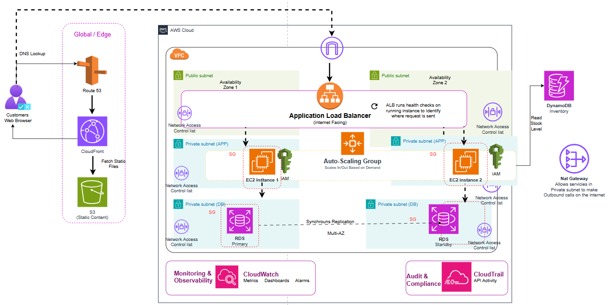

# AWS Resilient Healthcare Platform

> **Scenario:** A regional NHS Trust's patient portal collapsed during a national vaccination campaign. Traffic tripled in two hours. Appointment bookings failed, clinical staff lost access to patient records, and the system was down long enough to disrupt an entire day of planned care. This architecture prevents it from happening again.

---

## The Problem

Hartwell NHS Foundation Trust runs a patient-facing digital platform covering appointment booking, test results, medication queries, and clinical staff access to patient records. The platform runs on a handful of EC2 instances sitting behind a load balancer, connected to a single RDS database. Everything is hosted in one Availability Zone.

During a national vaccination campaign rollout, the Trust sent appointment invitations to hundreds of thousands of patients over a single weekend. Within two hours, traffic tripled. The database became the bottleneck first, then the application servers fell over. The platform was down for several hours.

The consequences were not just financial. Clinical teams could not access patient records. Appointment scheduling ground to a halt. Patients calling to rebook overwhelmed the phone lines. For a healthcare system, downtime is not an inconvenience — it is a patient safety risk.

Three things caused the failure:

1. **Single point of failure.** Every request went to one cluster of servers in one physical location. When that location was overwhelmed, there was nowhere else to route traffic.
2. **No automatic scaling.** The infrastructure was sized for normal operating load. There was no mechanism to add capacity as demand rose.
3. **One database doing everything.** The primary database handled complex clinical queries and simple lookups at the same time. Under pressure, everything slowed, then stopped.

The goal is an architecture that absorbs sudden demand without manual intervention, keeps running if one part of the infrastructure fails, and costs roughly normal amounts when the health system is not in a campaign period.

---

## Architecture Overview

The solution introduces network isolation, geographic redundancy, automatic scaling, and separation of read-heavy lookup data from the core clinical database.

| Layer | Problem | AWS Services |
|-------|---------|-------------|
| Traffic | Routing requests across healthy servers in multiple locations | Route 53, CloudFront, S3, ALB |
| Compute | Scaling application servers automatically under load | EC2, Auto Scaling Group |
| Data | Handling database pressure and preventing data loss | RDS Multi-AZ, DynamoDB |
| Security | Isolating clinical systems from the public internet | VPC, Subnets, Security Groups, NACLs, IAM |
| Cost | Running efficiently between campaigns | Right-sizing, Savings Plans, on-demand scaling |
| Observability | Detecting problems before patients and staff notice them | CloudWatch, CloudTrail |

---

## Architecture Diagram

*Diagram showing: Route 53 and CloudFront at the edge, an internet-facing ALB spanning two Availability Zones in public subnets, EC2 instances managed by an Auto Scaling Group in private application subnets, RDS Primary and Standby in private database subnets with synchronous Multi-AZ replication, DynamoDB for formulary and inventory lookups, a NAT Gateway for outbound-only internet access from private subnets, and CloudWatch and CloudTrail for monitoring and audit.*

---

## The AWS Decision Stack

---

### 1. Traffic

**The question:** How do requests reach the platform, how do you keep them flowing when one location fails, and how do you protect patient-facing systems at the front door?

**What was chosen: Route 53 + CloudFront + S3 + Application Load Balancer**

**Why Route 53?**

Every request starts with DNS. When a patient or clinician types the portal URL, their browser needs to find the server address behind it. Route 53 is AWS's managed DNS service. It directs that first lookup to CloudFront at the edge, which means traffic is distributed and protected before it ever touches the infrastructure inside the AWS region.

In the previous single-AZ setup, the DNS pointed directly at the servers. If those servers failed, there was no redirect. Route 53, combined with health checks, can automatically reroute traffic away from unhealthy endpoints.

**Why CloudFront and S3?**

The patient portal has a significant amount of content that does not change between requests: the HTML page structure, stylesheets, JavaScript, logos, and static information pages. In the previous setup, the application servers were delivering all of this on every visit. During the campaign spike, they were spending compute serving files that were identical for every user.

Moving static content to S3 and distributing it through CloudFront removes that burden entirely. CloudFront caches these files at Edge Locations close to users. The application servers only receive requests that require actual processing, such as booking an appointment or retrieving a test result.

**Why the Application Load Balancer (ALB)?**

The original load balancer existed but had a critical limitation: it only operated in one Availability Zone. An Availability Zone is a physically separate data centre within an AWS Region. If that zone experienced a problem, whether a hardware failure, a network issue, or overwhelming load, the entire platform went down.

The ALB in this architecture spans two Availability Zones simultaneously. It continuously runs health checks on every EC2 instance behind it. If a server becomes unhealthy or unresponsive, the ALB immediately stops sending traffic to it and routes requests to the remaining healthy instances in either zone. The patient or clinician making the request notices nothing.

The ALB sits in public subnets (one per Availability Zone) because it needs to receive traffic from the internet. Everything behind it stays private.

---

### 2. Compute

**The question:** What runs the application logic, and how does it handle a 3x traffic spike without a human needing to provision new servers?

**What was chosen: EC2 with an Auto Scaling Group**

**Why EC2 rather than Lambda (as used in Solution 1)?**

Lambda is the right tool when individual operations are short and event-driven, such as processing a single form submission. It was the right choice for the startup in Solution 1.

A healthcare patient portal is more complex. It handles session management, complex database queries that join multiple tables, integrations with NHS systems, background processing jobs for appointment reminders and results notifications, and workflows that may take longer than 15 minutes to complete. Lambda has a hard execution limit of 15 minutes per function invocation. Any process that exceeds that limit is cut off mid-execution. For a clinical workflow, that is not acceptable.

EC2 instances run continuously, hold application state across requests, and have no execution time limits. They are the right model for applications with this kind of complexity.

**Why an Auto Scaling Group?**

An Auto Scaling Group (ASG) manages the number of EC2 instances running at any given time. You define the rules, and it adds or removes servers automatically without human intervention.

In this architecture, the ASG scales on CPU utilisation. When the average CPU across all running instances exceeds the threshold (typically around 70%), the ASG launches new instances to share the load. When CPU drops back down, it terminates the excess instances so the Trust is not paying for capacity it does not need.

During the vaccination campaign spike, this means the platform would have expanded automatically as traffic climbed, then contracted once the demand passed. No engineer would have needed to wake up at 2am to provision servers.

EC2 instances run in private application subnets across both Availability Zones. The Auto Scaling Group places instances in each zone, so if one zone has a problem, the platform continues serving requests from the other.

**What about containers and microservices?**

The diagram references Amazon ECS and AWS Fargate. Containers package application code with all its dependencies into a portable unit that runs consistently across environments. Fargate is a managed service that runs containers without requiring you to manage the underlying servers.

These are the right tools if the Trust eventually decides to break the application into microservices (separate services for booking, results, medications, and staff access). Breaking a monolith into microservices is a significant engineering undertaking, but the payoff is that each service can be scaled independently. If appointment bookings spike during a campaign, only that service needs extra capacity, not the entire platform.

For now, the EC2 plus ASG approach handles the immediate resilience problem without requiring an architectural transformation. Migrating to ECS and Fargate is a natural next step once the foundation is stable.

---

### 3. Data

**The question:** How do you stop the database from becoming a bottleneck, and how do you make sure no patient data is lost if the primary database fails?

**What was chosen: RDS Multi-AZ (primary and standby) + DynamoDB for lookups**

**Why RDS Multi-AZ?**

The original setup had one RDS database in one Availability Zone. This created two problems. First, all read and write traffic competed for the same resource. Second, if that one database failed, no data was accessible at all.

RDS Multi-AZ runs two database instances simultaneously: a primary and a standby. The primary handles all read and write traffic. AWS replicates every transaction to the standby synchronously, meaning the standby is always an exact copy of the primary with no data lag. If the primary instance fails for any reason, AWS automatically promotes the standby to become the new primary. This failover typically completes in under two minutes and requires no manual intervention.

For a patient record system, this matters enormously. A database failure that previously meant hours of downtime now means at most a two-minute interruption while the standby takes over.

The standby instance runs in a different Availability Zone to the primary. If the entire zone containing the primary database experiences a problem, the standby in the other zone continues serving the application without interruption.

**Why DynamoDB alongside RDS?**

The clinical database (RDS) handles complex queries: finding all appointments for a consultant on a given day, cross-referencing a patient's medication history with their current prescriptions, pulling a complete patient record across multiple tables. These queries are what RDS is built for.

But not every database operation during a peak load event is complex. Queries like "is this medication on the approved formulary?", "what is the current stock level of this item at pharmacy?", and "which appointment slots are available today?" are simple lookups. They retrieve a single value by a known key. They do not need to join tables, and they do not need a relational database.

Moving these simple lookups to DynamoDB removes a significant volume of traffic from the RDS instance during peak periods. DynamoDB scales automatically like Lambda — it has no maximum connection pool and no provisioned capacity to run out of. When 50,000 patients simultaneously check whether the portal has their results ready, DynamoDB handles those lookups without touching the clinical database at all.

The rule of thumb: keep complex, relational clinical data in RDS. Move simple, high-frequency lookups to DynamoDB.

---

### 4. Security

**The question:** How do you make sure clinical systems are never directly accessible from the internet, and how do you control what each component can communicate with?

**What was chosen: VPC with public and private subnets, Security Groups, Network ACLs, and IAM**

Healthcare data is among the most sensitive data that exists. The security design starts from the principle that nothing clinical should ever be directly reachable from the internet. Several layers enforce this.

**The VPC**

A Virtual Private Cloud (VPC) is your own isolated, private network inside AWS. Think of it as a walled data centre that you define. You decide what is inside it, how the internal components communicate with each other, and what, if anything, is accessible from the outside world. Everything in this architecture lives inside the VPC.

**Public and Private Subnets**

A subnet is a section of the VPC with its own routing rules. The routing rules are what make a subnet public or private.

A public subnet has a route to the internet gateway, which means resources inside it can send and receive traffic from the public internet (if the security group allows it). Only the Application Load Balancer sits in the public subnets.

A private subnet has no direct route to or from the public internet. Nothing outside AWS can initiate a connection to a resource in a private subnet. EC2 application servers and RDS databases both run in private subnets. A patient's browser cannot reach them directly. The only way in is through the ALB.

**The NAT Gateway**

Private subnet resources sometimes need to make outbound calls to the internet: downloading a software update, calling an NHS API, or fetching a certificate revocation list. The NAT Gateway sits in the public subnet and allows outbound-only internet access from private resources. It is a one-way door: private resources can call out, but nothing from the internet can call in through it.

**Security Groups**

A Security Group is a virtual firewall attached to a specific resource. It controls exactly what traffic is allowed in and out of that resource. The rules here are strict:

- The **ALB Security Group** accepts HTTPS traffic from the internet (port 443) and nothing else.
- The **EC2 Security Group** accepts traffic only from the ALB's Security Group. A request arriving from anywhere else is dropped. Even within the VPC, an EC2 instance will not respond to something that is not the ALB.
- The **RDS Security Group** accepts database connections only from the EC2 Security Group. The database will not respond to the ALB, to the NAT Gateway, or to anything that is not an application server.

**Network Access Control Lists (NACLs)**

NACLs are a broader filter that operates at the subnet level rather than the resource level. If Security Groups are the bouncer checking IDs at the door of a specific room, NACLs are security on the floor, checking who is allowed into that section of the building at all. They provide a second layer of defence. Even if a Security Group were misconfigured, a NACL can stop suspicious traffic from reaching the subnet entirely.

**IAM**

Identity and Access Management controls what each AWS service can do within the account. The EC2 instances have an IAM role that grants them permission to read from the DynamoDB formulary table and write to CloudWatch logs. Nothing more. They cannot access S3, they cannot read other DynamoDB tables, and they cannot call other AWS services. If an application server were compromised, the attacker would find a tightly constrained set of permissions rather than open access to the account.

---

### 5. Cost and Budget

**The question:** How do you handle massive campaign spikes without paying for that capacity year-round?

**What was chosen: Auto Scaling with right-sizing, Savings Plans, and on-demand capacity**

The previous architecture had a fixed number of servers sized for normal load. During campaigns they were insufficient. During quiet periods they ran at low utilisation, costing the Trust money for capacity that was not being used.

The new model separates baseline from burst:

**Right-sizing** means running the smallest instance types that can handle normal operating load efficiently. You determine this by actually measuring CPU, memory, and network utilisation during typical operating hours, not by guessing. AWS Cost Explorer and CloudWatch provide the data to make this assessment. An oversized instance running at 15% utilisation is waste; a correctly sized instance running at 60-70% is efficient.

**Savings Plans** commit to a minimum level of compute spend for one or three years in exchange for a discount of up to 66% compared to on-demand rates. The Trust can commit to the baseline capacity it knows it will always need (the servers that run year-round) and receive the discount on that committed portion.

**On-demand instances** cover the burst. When the Auto Scaling Group adds servers during a campaign spike, those additional instances run at on-demand pricing. The Trust pays for them only for the hours they run. Once the campaign ends and traffic returns to normal, the ASG terminates the excess instances and the cost drops back to baseline.

The net result: a platform that can handle 3x traffic without pre-purchasing the capacity to do so permanently.

---

### 6. Observability and Monitoring

**The question:** How does the Trust know the platform is healthy, and how does it detect problems before patients and clinical staff are affected?

**What was chosen: CloudWatch for monitoring + CloudTrail for audit**

**CloudWatch**

CloudWatch collects metrics and logs from every AWS service in the architecture. It can alert the engineering team before a problem becomes visible to users.

Useful things to monitor in a healthcare context:

- **EC2 CPU and memory:** Rising averages indicate the Auto Scaling Group should be adding instances. An alarm at 80% average CPU, for example, gives the team warning before the system becomes unresponsive.
- **ALB 5xx error rate:** HTTP 500-range errors mean the application servers are returning failures. An alarm here catches application errors within minutes.
- **RDS connections and read/write latency:** A spike in database latency often precedes a wider outage. Catching it early means the team can investigate before patients are affected.
- **Auto Scaling Group events:** Every time a new instance is added or removed, CloudWatch logs the event. This gives a picture of how the platform responds to demand over time.
- **DynamoDB consumed read/write capacity:** If the formulary lookups are consuming more than expected, it shows up here.

Set alarms on the metrics that matter most and connect them to an alerting channel — an SNS topic that sends SMS or email to the on-call engineer. The platform should be the first thing that knows something is wrong, not a patient calling the helpline.

**CloudTrail**

CloudTrail is different from CloudWatch. CloudWatch tells you what the platform is doing in real time. CloudTrail records every API call made against your AWS account: who changed a security group rule, who modified the RDS configuration, which IAM role performed a database query, and when.

For a healthcare organisation, this is not optional. Clinical data systems are subject to NHS Data Security and Protection standards, NHS DSP Toolkit requirements, and UK GDPR. Being able to produce a complete audit trail of who accessed what and when is a compliance requirement.

CloudTrail logs should be written to a separate S3 bucket with write-once controls enabled. This ensures that even if an incident compromised the main environment, the audit log remains intact.

---

## Request Lifecycle Walkthrough

Here is what happens when a patient logs into the portal and books a vaccination appointment:

**Step 1 — DNS**
The patient opens the portal URL. Their browser queries Route 53, which returns the CloudFront distribution address.

**Step 2 — Static content**
CloudFront serves the portal login page (HTML, CSS, JavaScript) from the nearest Edge Location. The application servers are not involved at this stage. The patient sees the login page immediately.

**Step 3 — Login request**
The patient enters their credentials and submits. The browser sends a POST request to the portal's API endpoint. CloudFront passes this to the Application Load Balancer, which is running a health check against all available EC2 instances across both Availability Zones.

**Step 4 — Application processing**
The ALB forwards the request to a healthy EC2 instance. The application server validates the patient's credentials, checks their record in RDS, and creates a session. The session confirmation is returned to the browser.

**Step 5 — Appointment availability**
The patient navigates to the booking page. The portal makes a high-frequency lookup to DynamoDB to retrieve available appointment slots for the selected clinic. DynamoDB returns the result in single-digit milliseconds. The RDS database is not involved in this query.

**Step 6 — Booking confirmation**
The patient selects a slot and confirms. The EC2 instance writes the appointment to the RDS database, which replicates the transaction synchronously to the Multi-AZ standby. The patient receives their confirmation.

**Step 7 — Scale event (during campaign)**
As thousands of patients follow the same flow simultaneously, the ALB distributes requests across all available EC2 instances in both AZs. Average CPU rises above the scaling threshold. The Auto Scaling Group launches additional EC2 instances. Within minutes, the platform has expanded to meet demand. No one intervenes manually.

**Throughout — Monitoring**
CloudWatch captures every metric. CloudTrail logs every API call. If an error rate alarm fires, the on-call engineer receives an alert with context about which component is failing.

---

## Trade-offs and Limitations

**EC2 cold start time.** When the Auto Scaling Group launches a new instance, it takes a few minutes to boot, run startup scripts, and pass the ALB health check. During a very sudden spike, there is a brief period where incoming traffic is hitting the existing instances at full capacity before the new ones come online. You can reduce this gap by pre-warming during expected high-demand periods (scheduled scaling before a campaign launch) and by keeping AMIs lean so instances start faster.

**RDS Multi-AZ failover window.** If the primary RDS instance fails, the failover to standby typically completes in 60 to 120 seconds. During this window, database connections will fail and the application will return errors. Design the application to handle database connection failures gracefully with retry logic, so users see a "please wait" message rather than an unhandled crash.

**DynamoDB data modelling.** Moving formulary and inventory lookups to DynamoDB requires that these data sets are exported and kept in sync. DynamoDB does not join tables. If the lookup requirements become complex (for example, checking a medication against a patient's existing prescriptions), it belongs in RDS. Be disciplined about what goes where.

**Cost of Multi-AZ.** Running a standby RDS instance in a second Availability Zone roughly doubles the database cost compared to a single-AZ instance. For a healthcare platform, this is the right trade-off. For a non-critical internal tool, you might accept single-AZ and restore from backup instead. For anything holding patient data, Multi-AZ is not optional.

**CloudTrail cost.** CloudTrail logs every API call, which can generate a significant volume of log data over time. Store logs in S3 with a lifecycle policy that moves older logs to S3 Glacier after 90 days to keep storage costs manageable while retaining the full audit history.

---

## Key Takeaways

- Single points of failure are the enemy. Everything in this architecture has a counterpart in a second Availability Zone. If one location has a problem, the other keeps serving patients.
- Auto Scaling matches cost to demand. The Trust pays for campaign-level capacity only during campaigns, not year-round.
- Not all database traffic is equal. Moving simple lookups to DynamoDB relieves pressure on the clinical RDS database where it matters most.
- Private subnets protect clinical data. Nothing patient-facing or data-sensitive has a direct route from the internet. The ALB is the only front door.
- Security Groups work in chains. Each component only accepts traffic from the component immediately upstream. The database cannot be reached from the internet even if every other layer were bypassed.
- Monitoring and audit are not the same thing. CloudWatch tells you the platform is failing right now. CloudTrail tells you what happened, who did it, and when — which is what the compliance team needs.

---

## Services Used

| Service | Category | Purpose |
|---------|----------|---------|
| Amazon Route 53 | Traffic | DNS routing and health-based failover |
| Amazon CloudFront | Traffic | CDN and edge caching for portal static assets |
| Amazon S3 | Traffic / Data | Static content hosting |
| Application Load Balancer | Traffic | Multi-AZ request distribution with health checks |
| Amazon EC2 | Compute | Application servers running the patient portal |
| Auto Scaling Group | Compute | Automatic capacity management based on demand |
| Amazon RDS (Multi-AZ) | Data | Clinical relational database with synchronous standby |
| Amazon DynamoDB | Data | Formulary and inventory lookups |
| Amazon VPC | Security | Isolated private network environment |
| Public / Private Subnets | Security | Network segmentation between internet-facing and internal resources |
| Security Groups | Security | Per-resource traffic rules |
| Network ACLs | Security | Subnet-level traffic filtering |
| NAT Gateway | Security | Outbound-only internet access for private subnet resources |
| AWS IAM | Security | Permissions and access control per service |
| Amazon CloudWatch | Observability | Metrics, logs, alarms, and dashboards |
| AWS CloudTrail | Observability | API activity audit log for compliance |

---

*Architecture designed and documented as part of an AWS Solutions Architecture learning series.*
*This solution addresses real-world resilience requirements common to healthcare digital platforms handling variable public demand.*
