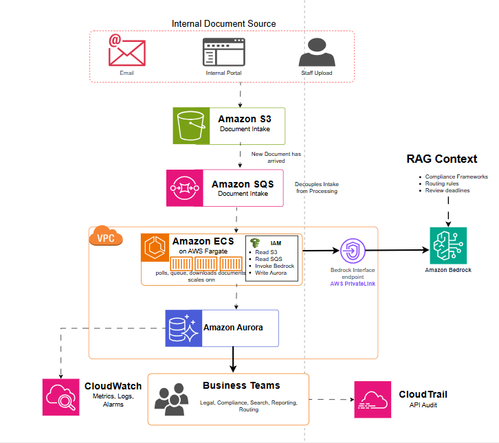

# AWS AI-Powered Health Document Intelligence Platform

> **Scenario:** A pan-African health commission is drowning in thousands of documents every day — outbreak reports, clinical surveillance filings, regulatory submissions, and cross-border compliance records arriving from 54 member states. A team of 40 staff read each one manually, classify it, extract key information, and route it to the right department. During major disease events, the backlog grows faster than the team can clear it. This architecture replaces that manual process entirely with an AI-powered pipeline.

---

> **Simulated Scenario Notice**
> This project is entirely fictional and built for learning purposes. The organisation, data, documents, and outcomes described here are simulated. Any resemblance to real organisations, individuals, or events is coincidental. The architecture principles, AWS services, and engineering decisions are real and reflect genuine industry practice.

---

## The Problem

The **Pan-African Health Intelligence Commission (PAHIC)** is a fictional intergovernmental body that coordinates disease surveillance, outbreak response, and health regulatory compliance across the African continent. Every day, thousands of documents flow in from member state health ministries, field epidemiology teams, clinical research networks, pharmaceutical manufacturers, and regional WHO field offices. These include:

- Disease outbreak situation reports
- Epidemiological surveillance filings
- Clinical trial regulatory submissions
- Cross-border patient movement records
- Pharmaceutical compliance certificates
- Emergency health declarations
- Funding and programme performance reports

Currently, 40 staff work in rotating shifts to manage this intake. Each person opens a document, reads enough of it to determine what type it is, extracts key fields (document type, country of origin, disease or condition referenced, urgency level, and the department it should go to), logs the result in a spreadsheet, and emails the document onward.

Three things make this unsustainable:

1. **Volume and speed mismatch.** During normal operations the team keeps pace. During an active outbreak event, incoming document volume can spike 4x to 6x in 48 hours. The team cannot scale fast enough. Critical outbreak reports sit unread for hours. Delayed routing delays the response.

2. **Human error under pressure.** Mis-classification and wrong routing happen routinely, particularly when staff are fatigued during a multi-week emergency response. In a health context, a regulatory submission routed to the wrong department and missed can mean a delayed treatment approval or a compliance breach with a member state.

3. **The cost is disproportionate.** Forty people, across management overhead, training, shift cover, and error correction, represent an enormous operational cost for a process that is fundamentally mechanical. The information needed to classify and route these documents is knowable and consistent — it is exactly the kind of task AI is suited for.

The goal is a system that processes every document as it arrives, classifies it correctly, extracts structured information, routes it to the right team, and stores the result in a queryable format — at any volume, around the clock, without a human reading each file first.

---

## Architecture Overview

The architecture is an event-driven AI processing pipeline. Documents arrive from multiple intake channels, queue for processing, and are analysed by a continuously running container fleet that calls a private AI model with the organisation's compliance knowledge built in.

| Layer | Problem | AWS Services |
|-------|---------|-------------|
| Traffic | Managing document intake from multiple sources without losing files | Amazon S3, Amazon SQS |
| Compute | Processing complex documents with AI at scale, continuously | Amazon ECS, AWS Fargate |
| AI | Classifying, extracting, and routing with regulatory context | Amazon Bedrock, RAG, AWS PrivateLink |
| Data | Storing structured AI output for downstream business use | Amazon Aurora, Amazon S3 |
| Security | Keeping health data private, controlling service permissions | VPC, IAM, AWS PrivateLink, CloudTrail |
| Cost | Paying for what is used, building a business case for the replacement | Usage-based pricing across all services |
| Observability | Proving the system works and monitoring processing health | CloudWatch, CloudTrail, Aurora audit table |

---

## Architecture Diagram

*Diagram showing: internal document sources (email, internal portal, staff upload) landing in S3, SQS decoupling intake from processing, ECS on Fargate polling the queue and processing each document, Fargate calling Amazon Bedrock through a private PrivateLink endpoint with RAG context attached, results written to Aurora, and output consumed by business teams (Legal, Compliance, Search, Reporting, Routing), with CloudWatch and CloudTrail across the environment.*

---

## The AWS Decision Stack

---

### 1. Traffic

**The question:** Documents arrive from different sources at unpredictable rates. How do you make sure nothing is lost, and how do you stop a sudden volume spike from overwhelming the processing pipeline?

**What was chosen: Amazon S3 (intake) + Amazon SQS (queue)**

**Why S3 for document intake?**

Documents arrive through three channels: email (converted and forwarded by a connector service), the internal staff portal (where field teams upload filings directly), and automated uploads from integrated member state systems. All three channels write their documents to a single Amazon S3 bucket configured as the intake point.

S3 is the right landing zone for several reasons. It handles any file size, any file type, and any volume without configuration changes. Every file written to S3 is stored durably with automatic redundancy across multiple physical locations. There is no "inbox full" error. Whether five documents arrive or five thousand in a single hour, S3 accepts them all.

**Why SQS? And what does "decoupling" actually mean?**

Once a document lands in S3, the processing needs to begin. But you cannot simply throw all incoming files at the processing fleet simultaneously. During an outbreak event, five thousand documents arriving in two hours would overwhelm the system if processed all at once.

Amazon SQS (Simple Queue Service) sits between the intake layer and the processing layer. Every time a new document arrives in S3, an event notification places a message in the SQS queue. That message says: "a new document is waiting, here is its location."

The word "decoupling" means the intake side and the processing side are now independent. S3 accepts documents at whatever rate they arrive. SQS holds the messages. The processing containers read from the queue at the rate they can handle, one document at a time. If more processing capacity is needed, more containers spin up and pull from the same queue. If the queue grows faster than current capacity, ECS automatically launches more containers.

This prevents two failure modes. First, a sudden intake spike does not crash the processing system — messages queue safely and get processed in order. Second, if the processing fleet has a brief outage, documents are not lost. They sit in the queue and processing resumes from where it stopped when the fleet recovers.

SQS charges fractions of a penny per million messages. At 1,000 documents per day, this cost is negligible.

---

### 2. Compute

**The question:** Something needs to read each document, send it to an AI model, interpret the response, and write the result. What runs this workflow, and why?

**What was chosen: Amazon ECS on AWS Fargate**

**Why not Lambda?**

Lambda is the right tool for short, event-driven tasks. Receiving a form submission, triggering a notification, or resizing an uploaded image — these are Lambda's natural fit.

Document intelligence processing is different in two specific ways that rule Lambda out:

First, Lambda has a hard execution time limit of 15 minutes per invocation. A complex health document, particularly a lengthy clinical trial submission or a multi-country epidemiological report, can take longer than that to download from S3, prepare for the AI model, send to Bedrock, receive the response, validate the output, and write the results to Aurora. Lambda would cut the process off mid-execution.

Second, every Lambda invocation starts from a cold state. It downloads the document, loads the AI libraries, establishes a connection to Bedrock and Aurora, and then executes — and when it finishes, it shuts down. The next document starts the same setup process again. At 1,000 documents per day, these repeated setup costs are real and measurable. They add latency to every document and increase overall processing time.

**Why Fargate?**

AWS Fargate runs application containers without requiring you to manage the underlying servers. You package your processing application and all its dependencies into a container, define how much CPU and memory it needs, and Fargate handles the rest.

The key difference from Lambda is that the container runs continuously. It starts once, loads the libraries, establishes its connections to Bedrock and Aurora, and then sits in a loop: poll the SQS queue, pick up the next message, process the document, write the result, poll again. The connections are kept open and reused across every document. There is no per-document setup overhead.

When the SQS queue grows because documents are arriving faster than the current fleet can process them, Amazon ECS (Elastic Container Service, which manages the containers running on Fargate) automatically launches additional container instances to work through the backlog. When the queue empties and processing demand drops, excess containers are terminated. You pay only for the compute time the containers actually used.

There is also no 15-minute limit. A particularly complex document that takes 40 minutes to process correctly does so without interruption.

**The processing workflow inside the container**

Each container runs the following loop continuously:

1. Poll the SQS queue for the next message
2. Download the referenced document from S3
3. Prepare the document text and attach the RAG context (the organisation's compliance knowledge)
4. Send the prepared prompt to Amazon Bedrock
5. Receive the structured AI response
6. Validate the extracted fields against expected formats
7. Write the structured result to Amazon Aurora
8. Delete the SQS message (confirming processing is complete)
9. Return to step 1

If a document fails (the AI returns an unexpected format, or a downstream write fails), the message remains in the SQS queue and is retried after a configured delay. After a defined number of failures, the message is moved to a dead-letter queue for human review. Nothing is silently dropped.

---

### 3. AI — Amazon Bedrock and RAG

**The question:** What AI model does the work, how is the organisation's specific knowledge built in, and how do you keep sensitive health documents away from public model infrastructure?

**What was chosen: Amazon Bedrock + RAG context + AWS PrivateLink**

**Why Amazon Bedrock?**

Amazon Bedrock is AWS's managed service for accessing foundation AI models — including models from Anthropic (Claude), Meta, and others — directly from application code running inside your AWS environment.

The critical distinction from using a public AI API: Bedrock is a private AWS service. Calling it from inside a VPC means the document never leaves the AWS network on the way to the model. AWS contractually guarantees that your prompts and the model's responses are not used to train future models and are not accessible to the model provider. For an organisation processing sensitive health surveillance data and confidential regulatory filings, this is not optional — it is a fundamental requirement.

**What is RAG and why does it matter here?**

RAG stands for Retrieval-Augmented Generation. It is a way of giving an AI model specific knowledge that is not built into the model's training.

When the processing container sends a document to Bedrock, it does not just send the document and ask "what is this?" It attaches a carefully constructed context containing:

- PAHIC's document classification taxonomy (what types of documents exist and what distinguishes them)
- Routing rules (which document type goes to which department and under what conditions)
- Review deadlines (how urgently each category needs to be acted on)
- Outbreak escalation criteria (what language or content in a surveillance report should trigger an urgent flag)
- Member state identifiers (how to correctly attribute a document to the right country and ministry)

Without this context, the AI would produce a general summary. With it, the AI produces a structured output that matches exactly the fields PAHIC's routing system needs: document type, originating country, referenced disease or condition, urgency classification, recommended department, and extracted key facts.

The RAG knowledge base is maintained by the compliance and operations team. When routing rules change or a new document type is added, they update the knowledge base without touching the application code.

**Why AWS PrivateLink?**

PrivateLink creates a private network endpoint inside the VPC that connects directly to Amazon Bedrock. Instead of the container's API call to Bedrock leaving the VPC and travelling over the public internet, it stays entirely within AWS's private network infrastructure.

This matters for two reasons. The security posture is stronger — there is no internet exposure point for the AI call. And for regulatory purposes, the organisation can demonstrate that patient and clinical data never traversed a public network on its way to or from the AI model.

---

### 4. Data

**The question:** Where does the AI's output live, and what happens to the original documents?

**What was chosen: Amazon Aurora (structured results) + Amazon S3 with archiving (original documents)**

**Why Aurora rather than standard RDS?**

Aurora is AWS's own relational database engine, compatible with MySQL and PostgreSQL but built on a distributed storage architecture. It is the right choice here for two reasons specific to this use case.

First, Aurora performs significantly better than standard RDS at the write rates this pipeline generates. At 1,000 documents per day, the system is writing structured records continuously across all hours. Aurora's underlying storage layer handles high concurrent write throughput better than a standard RDS instance.

Second, Aurora scales storage automatically. As the volume of processed documents accumulates, the storage grows without manual intervention. Standard RDS requires you to pre-allocate storage and manually expand it.

The Aurora database stores the structured output from each document: a row per document with columns for document type, source country, referenced condition or disease, urgency level, assigned department, processing timestamp, model confidence score, and the key extracted facts. Business teams query this table directly — the compliance team pulls all high-urgency filings received in the last 24 hours, the legal team searches by document type and originating country, and the epidemiology team queries by disease or condition to track report volume over time.

**What happens to the original documents?**

Original documents remain in S3. They are not deleted after processing. S3 lifecycle rules manage their cost over time:

- **0 to 90 days:** Documents stay in standard S3 storage, immediately accessible for review or reprocessing if needed.
- **90 days to 1 year:** Documents transition to S3 Glacier Instant Retrieval (cold storage), which costs roughly 80% less than standard S3. Documents are still retrievable within milliseconds if needed for audit or legal review.
- **Beyond 1 year:** Documents move to S3 Glacier Deep Archive, the lowest-cost storage AWS offers, at roughly $1 per terabyte per month. Documents are retrievable within 12 hours. For a regulatory filing that is unlikely to be needed but must be retained, this is the right tier.

These lifecycle rules are configured once and run automatically.

---

### 5. Security

**The question:** How do you keep sensitive health and regulatory data protected, control what each part of the system can access, and produce the audit trail the organisation needs?

**What was chosen: VPC, IAM, AWS PrivateLink, CloudTrail**

**VPC isolation**

The entire processing pipeline runs inside a Virtual Private Cloud. The ECS containers, the Aurora database, and the connection to Bedrock are all private. No part of the processing pipeline is reachable from the public internet. Documents arrive in S3 (which sits at the edge of the VPC) and everything downstream is internal.

**IAM — minimum access per service**

Every component has an IAM role that grants exactly what it needs to do its job:

- The **ECS container role** can read from the intake S3 bucket, read from and delete messages in the SQS queue, invoke specific Bedrock models, and write to the Aurora database. It cannot access other S3 buckets, other SQS queues, or any other AWS service.
- The **Aurora database** accepts connections only from the ECS container network. It is not directly accessible to human users except through a designated, audited access mechanism.
- The **Bedrock RAG knowledge base** contains only the compliance frameworks, routing rules, and review deadlines loaded by the operations team. The containers cannot modify it.

**AWS PrivateLink for Bedrock**

Described in the compute section: the PrivateLink endpoint ensures all communication between the containers and the Bedrock AI model travels entirely within AWS's private network, never over the public internet.

**CloudTrail — the audit record**

CloudTrail logs every API call made in the AWS account: when a container read from SQS, when a Bedrock model was invoked, when a record was written to Aurora, when an IAM role was used or modified. Every action has a timestamped, tamper-evident log entry.

For a health organisation processing regulatory filings, this is not optional. Regulators may ask: who accessed document X, when was it processed, what model version was used, and what did the model return? CloudTrail, combined with the audit table in Aurora (which logs model version, confidence score, and processing time per document), answers all of those questions.

---

### 6. Cost and Budget

**The question:** What does this cost to run, and how does it compare to the existing manual operation?

**The current cost of the manual process**

Forty staff working on document intake represents a significant annual salary cost. Beyond salaries: management overhead, shift cover, training, and error remediation. When a document is mis-classified or routed incorrectly, someone spends time tracking it down and correcting the record. During an outbreak event, delayed routing of critical surveillance reports has regulatory and reputational consequences that are difficult to price but are real.

The speed cost is also significant. Documents taking hours or days to reach the right team means slower response, slower decisions, and slower deployment of health resources.

**The infrastructure cost**

All services in this architecture charge based on actual usage:

| Service | Pricing model | Approximate scale at 1,000 docs/day |
|---------|--------------|-------------------------------------|
| Amazon S3 | Per GB stored + per request | Low — documents are typically small |
| Amazon SQS | Per million messages | Negligible — ~$0.40 per million |
| AWS Fargate | Per vCPU/hour and GB memory/hour | Scales with document volume |
| Amazon Bedrock | Per 1,000 input/output tokens | Largest variable cost — scales with document length |
| Amazon Aurora | Per instance + per GB storage | Predictable monthly cost |
| CloudWatch / CloudTrail | Per log volume | Low |

At 1,000 documents per day, the total monthly infrastructure cost can be modelled before a single line of code is written. AWS provides a cost calculator for this purpose. The model typically shows monthly infrastructure spend as a fraction of what a single member of the 40-person team costs annually.

**Billing alarms**

A CloudWatch billing alarm is set before the system goes live. If monthly spend exceeds the budgeted amount, the operations team receives an alert immediately. This prevents unexpected cost surprises and gives early warning if document volume is growing faster than modelled.

**Right-sizing**

Fargate containers are configured with the CPU and memory profile that matches actual document processing needs. This is measured during a pilot period and adjusted. Over-provisioned containers waste money; under-provisioned containers slow processing. Once the steady-state performance profile is known, the configuration is tuned accordingly.

---

### 7. Observability and Monitoring

**The question:** How does the organisation know this system is actually doing the work, doing it correctly, and continuing to work as document volume grows?

**What was chosen: CloudWatch + Aurora audit table + CloudTrail**

This is an automated system replacing a process that was previously visible to 40 people. Leadership and operations teams need to see clearly that the automation is working. Three things provide that visibility.

**CloudWatch — operational health**

CloudWatch collects metrics from every service in the architecture:

- **SQS queue depth:** How many documents are waiting to be processed? A growing queue that is not clearing indicates the processing fleet needs to scale up, or something has stalled.
- **ECS container health:** Are containers running, and are they consuming the expected levels of CPU and memory?
- **Processing latency:** How long does each document take from SQS receipt to Aurora write? A sudden spike in latency could indicate a Bedrock response time issue or an unusually large document batch.
- **Error rate:** How many documents are failing processing and landing in the dead-letter queue? A low steady-state error rate is normal. A sudden spike indicates a problem with the prompt, the document format, or a downstream service.

A dashboard with these metrics, visible to the operations team, gives them the equivalent of watching the 40-person team at work — but with precise numbers and the ability to set automated alarms on any threshold.

**The Aurora audit table**

Every processed document writes a record to an audit table in Aurora containing: the document ID, the model version used, the processing timestamp, the confidence score returned by the model, and the routing decision. This allows the compliance team to:

- Pull a report of all documents processed in a given period
- Filter by confidence score to identify documents the model was uncertain about for human spot-check
- Verify that high-urgency outbreak reports were routed within the required time window
- Respond to regulatory enquiries about specific documents with a precise processing record

**CloudTrail — the unchangeable record**

CloudTrail logs are written to a dedicated S3 bucket with object-lock enabled, meaning the logs cannot be modified or deleted. If a regulator or auditor asks for the complete activity history of the system, CloudTrail provides it — every API call, every access, every model invocation, timestamped and signed.

---

## Processing Flow Walkthrough

Here is what happens from end to end when a disease outbreak situation report arrives from a field epidemiology team in West Africa:

**Step 1 — Document arrives**
The field team uploads the report through the internal portal. The portal writes the file to the S3 intake bucket. S3 triggers an event notification that places a message in the SQS queue.

**Step 2 — Queue**
The SQS message sits in the queue. It contains the document's S3 location and metadata. It will stay in the queue until a processing container picks it up. If no container is available immediately, the message waits safely.

**Step 3 — Container picks up the document**
A Fargate container polling the queue receives the message. It downloads the document from S3.

**Step 4 — Prompt construction**
The container prepares the prompt. It combines the document text with the RAG context: PAHIC's document taxonomy, outbreak escalation criteria, and routing rules. The prepared prompt tells the AI model exactly what to look for and what format to return the answer in.

**Step 5 — Bedrock call**
The container sends the prompt to Amazon Bedrock through the PrivateLink endpoint. The document never leaves the AWS private network. Bedrock processes the request using the configured model and returns a structured JSON response: document type (Outbreak Situation Report), originating country (Nigeria), disease referenced (Lassa fever), urgency level (HIGH), recommended department (Epidemiology Response), key extracted facts (case count, geographic spread, mortality rate).

**Step 6 — Validation and storage**
The container validates the response format. If it matches the expected schema, it writes the structured record to Aurora and sends the routing instruction to the Epidemiology Response team's workflow system. It deletes the SQS message to confirm processing is complete.

**Step 7 — Business team acts**
The Epidemiology Response team receives the routed document and the structured summary. They do not need to read the full filing to understand what it is and why it arrived. They open it knowing the disease, the urgency, and the key extracted numbers.

**Throughout**
CloudWatch records the processing time. The Aurora audit table captures the model version and confidence score. CloudTrail logs every API call.

---

## Trade-offs and Limitations

**AI confidence and human review.** The AI model will not always be confident about every document. Some filings are ambiguous, poorly formatted, or written in languages or technical dialects that produce lower confidence scores. The system flags these for human review rather than routing them automatically. The audit table's confidence score column is the mechanism for identifying which documents need a human second pass.

**Bedrock cost scales with document length.** Bedrock charges per token processed (input and output). A short two-page outbreak sitrep costs very little. A 200-page clinical trial submission costs significantly more. For very large documents, it may be worth pre-processing to extract the relevant sections before sending to Bedrock, rather than sending the full document each time.

**RAG context maintenance.** The quality of the AI's output depends directly on the quality of the RAG knowledge base. If routing rules change, the knowledge base must be updated promptly. An outdated classification taxonomy will produce outdated routing decisions. Ownership of the RAG context needs to sit with a specific team (compliance and operations) with a defined update process.

**Cold start on initial scaling.** When the SQS queue grows suddenly and ECS launches new containers, there is a brief period while the new containers initialise before they begin processing. This is measured in seconds rather than minutes, but it is not instant.

---

## Key Takeaways

- SQS is not just a buffer — it is a guarantee. Documents cannot be lost between intake and processing. If the processing fleet goes down, the queue holds everything safely until it recovers.
- Fargate suits continuous, long-running work. Lambda suits short, event-triggered work. The distinction is execution time limits and connection overhead. Know which problem you have before choosing.
- RAG is what makes general AI useful for a specific domain. Without the compliance knowledge injected into every prompt, the AI returns a generic summary. With it, it returns a routing decision the business can act on.
- PrivateLink is not optional for health data. Sensitive documents must not traverse the public internet on the way to an AI model. PrivateLink ensures they do not.
- The business case can be calculated before building. Model the infrastructure cost at target document volume and compare it to the fully-loaded cost of the manual team. The difference funds the project.
- Audit is a first-class requirement, not an afterthought. The Aurora audit table and CloudTrail are designed in from the start, not added after a compliance question arrives.

---

## Services Used

| Service | Category | Purpose |
|---------|----------|---------|
| Amazon S3 | Traffic / Data | Document intake and long-term archive |
| Amazon SQS | Traffic | Queue decoupling intake from processing |
| Amazon ECS | Compute | Container orchestration |
| AWS Fargate | Compute | Serverless container runtime |
| Amazon Bedrock | AI | Foundation model for document classification and extraction |
| AWS PrivateLink | Security | Private network endpoint to Bedrock |
| RAG Knowledge Base | AI | Organisation-specific compliance context for the AI model |
| Amazon Aurora | Data | Structured storage of AI-processed results and audit records |
| AWS IAM | Security | Per-service permission control |
| Amazon VPC | Security | Network isolation |
| Amazon CloudWatch | Observability | Metrics, logs, alarms, and processing dashboards |
| AWS CloudTrail | Observability | API audit log for compliance and regulatory purposes |

---

> **Reminder:** This is a simulated project built for portfolio and learning purposes. The Pan-African Health Intelligence Commission (PAHIC), the documents described, and all data referenced are entirely fictional. The AWS architecture, service choices, and engineering principles are real.

---

*Architecture designed and documented as part of an AWS Solutions Architecture learning series.*
*This solution demonstrates how event-driven AI pipelines replace high-volume manual document operations in regulated environments.*
