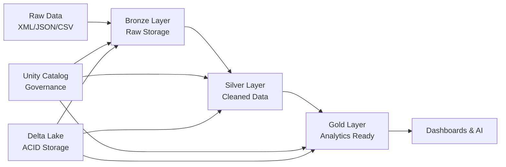

# 🏥 Your First Data Engineering Project: From Raw Data to Production Analytics

**Build your first complete data lakehouse from scratch** - completely free! This tutorial uses Apple Health data as an example, but the skills you learn apply to any data engineering project. Perfect for developers looking to break into data & AI.

-blue)


## 🎯 Why This Tutorial?

**There's huge demand for data and AI skills, but practical 'learn by doing' content is missing.** Whether you're prepping for interviews, building your portfolio, or just want hands-on experience with modern data stack, this tutorial gives you a solid foundation.

**This isn't just about health data** - we use Apple Health as a relatable example because everyone understands personal data. The architecture, patterns, and skills you'll learn apply to any data engineering project: financial data, IoT sensors, customer analytics, or real-time streams.

**You'll build something portfolio-worthy** that demonstrates real-world data engineering expertise employers want to see. By the end, you'll have hands-on experience with the same technologies used at companies like Netflix, Uber, and Databricks.

## 📋 What You'll Master

**Core Data Engineering Skills:**
- Medallion Architecture (industry-standard Bronze → Silver → Gold pattern)
- Data lakehouse principles used in production at scale
- Unity Catalog for enterprise data governance
- Apache Spark for distributed data processing
- Delta Lake for reliable, ACID-compliant storage

**Technical Skills That Get You Hired:**
- XML/JSON parsing and data transformation at scale
- SQL optimization and performance tuning
- Python data processing and visualization
- Production-ready pipeline development
- Data quality monitoring and validation

**Business Intelligence & Analytics:**
- Building analytics-ready datasets from raw data
- Implementing business logic and domain-specific scoring
- Creating dashboards and visualizations
- Performance analysis and trend identification

**By the end of this tutorial, you'll understand:**
- How to design and implement a complete data pipeline from scratch
- Why the medallion architecture is the gold standard for data lakehouses
- How to optimize queries for 10x performance improvements
- What makes data "production-ready" vs just working
- How to apply these skills to any data engineering project

## 🚀 Prerequisites

**No prior data engineering experience required!** This tutorial is designed for developers who want to learn data & AI fundamentals.

### 1. **Free Databricks Account**
- Sign up at [databricks.com/learn/free-edition](https://bit.ly/dbx-free-signup)
- No credit card required, free forever
- Includes Apache Spark, Delta Lake, and Unity Catalog
- 15GB storage with community support

### 2. **Sample Data (Provided)**
- Use our `sample_export.xml` to follow along
- **Optional:** Export your own iPhone data:
  1. Open Health app on iPhone
  2. Tap profile picture (top right)
  3. Select "Export All Health Data"
  4. Extract zip file to get `export.xml`

### 3. **Basic Knowledge (Helpful)**
- SQL fundamentals (we explain advanced concepts)
- Python basics (tutorial is step-by-step)
- Understanding of tables and databases

## 📁 Repository Contents

```
├── Health Analytics Demo.ipynb     # Complete step-by-step tutorial
├── data/
│   └── sample_export.xml           # Sample data to practice with
├── visuals/                        # Architecture diagrams and examples
└── README.md                       # This guide
```

## 🛠️ Quick Start

**Get up and running in 10 minutes:**

1. **Setup Databricks**
   - [Sign up for free account](https://bit.ly/dbx-free-signup)
   - Create new workspace


2. **Download the Required Files**

From this repository, download both:
   - `sample_export.xml` *(sample Apple Health file in the data folder)*
   - `Health Analytics Demo.ipynb` *(the Databricks notebook)*

3. **Upload to Databricks**
   - Go to the left sidebar → *Workspace* → *your user folder*
   - Click the *folder icon* and choose *"Import"*
   - Upload both the `.ipynb` and `.xml` files

4. **Start Learning**  
   - Follow step-by-step instructions in the notebook
   - Build your first data lakehouse!

<div align="center">
  
</div>


## 📚 Learning Journey

### **Foundation: Understanding Data Architecture**
You'll start by learning why traditional approaches fall short and how the lakehouse architecture solves real business problems. We'll set up Unity Catalog to understand enterprise data governance from day one.

### 🏗️ Lakehouse Architecture Overview  


### **Bronze Layer: Raw Data Ingestion**
- Unity Catalog volume creation and management
- Modern XML processing with Spark
- Delta table creation with proper governance metadata
- Understanding immutable data storage principles

### **Silver Layer: Data Transformation & Quality**
- Timestamp parsing and data type conversion
- Business logic implementation and categorization
- Data quality validation and monitoring
- Schema evolution and handling data changes

### **Gold Layer: Analytics & Business Intelligence**
- Daily aggregations and summary statistics
- Evidence-based scoring algorithms (applies to any domain)
- Pattern analysis and trend identification
- Creating dashboard-ready datasets

### **Production Optimization**
- Delta Lake ZORDER BY for 10x query performance
- Auto-optimization and maintenance strategies
- Monitoring and alerting best practices
- Scaling considerations for enterprise workloads


<div align="center">
  
</div>


### 🛠️ Optimization Commands

```sql
-- Reorganize data for common query patterns
OPTIMIZE health_data.gold.daily_health_summary
ZORDER BY (activity_date, metric_category);

-- Enable automatic optimization
ALTER TABLE health_data.gold.daily_health_summary
SET TBLPROPERTIES (
  'delta.autoOptimize.optimizeWrite' = 'true',
  'delta.autoOptimize.autoCompact' = 'true'
);
```


## 🏗️ Architecture You'll Build

**Medallion Architecture (Industry Standard):**
- **Bronze Layer** → Raw data ingestion with full audit trail
- **Silver Layer** → Cleaned, validated, business-ready data
- **Gold Layer** → Aggregated analytics and ML-ready features


<div align="center">
  
</div>


**Technology Stack:**
- **Unity Catalog** → Data governance and discovery
- **Delta Lake** → Reliable storage with ACID transactions
- **Apache Spark** → Distributed processing engine
- **SQL + Python** → Analytics and transformation logic



## 💡 Why This Approach Works

**Real-world applicable:** The patterns you learn here scale from personal projects to enterprise data platforms handling petabytes. Companies like Netflix, Databricks, and Uber use these exact architectural patterns.

**Portfolio-ready:** You'll have a complete end-to-end project demonstrating modern data engineering skills that hiring managers want to see. The project shows you can handle the full data lifecycle from ingestion to analytics.

**Foundation for AI:** This tutorial builds the data foundation needed for machine learning and AI projects. Clean, well-structured data in your Gold layer is exactly what ML models need.

<!-- ## 🎬 Video Tutorial

This repository accompanies our comprehensive YouTube tutorial series. Part 1 covers building the complete lakehouse architecture, while Part 2 extends into Power BI integration and AI assistant development. *Coming soon!*
-->
## 🌟 What's Next?

After mastering this tutorial, you'll have the foundation to tackle any data engineering challenge. The skills transfer directly to processing financial transactions, IoT sensor data, customer analytics, or real-time streaming data. Consider extending your project with Power BI dashboards or building AI agents for conversational analytics.


<div align="center">
  
</div>

## Connecting to PowerBI
#### Getting Databricks Credentials
<div align="center">
  
</div>

#### Setting up connection in PowerBI
<div align="center">
  
</div>

#### Final PowerBI Report using Databricks Gold layer dataset
<div align="center">
  
</div>

🔗 **[View the interactive Power BI dashboard](https://app.powerbi.com/view?r=eyJrIjoiZDQ4YWQ0MGMtODM2ZC00MWQ4LWI4NTAtMzkwNjQ5ZDA4MmRjIiwidCI6IjVlZGQyZmE1LTYxNDYtNDU4My1hMWIzLTM5NmNlNjdjNTI1YiIsImMiOjF9)**

#### Key Insights And Recommendation

Looking at this 2024 data it shows a consistent active with an average of **~6,280** steps per day and excellent resting heart rate around **48–50 bpm**, which puts you in great cardiovascular shape.
**Strengths:**
- Activity peaks on weekends and Mondays → you're crushing it with weekend hikes or workouts and starting the week strong!
- All metrics in normal range, stable weight, good HRV → strong recovery and low stress on the body.
**Opportunities:**
- Flights climbed average ~15/day – aim for 20+ to boost cardio further.
- Consider adding strength training if calories burned plateau mid-year.
- Keep tracking – your data shows consistency drives results. Set a 2026 goal of 7,000 avg steps and monitor HRV for recovery.

## 🤝 Contributing

Found ways to improve the tutorial? Fork the repository, create a feature branch, and submit a pull request. Contributions help make this resource better for everyone learning data engineering.


## 🔗 Connect & Learn More

Let’s stay in touch and keep learning together!

[](https://www.linkedin.com/in/)
[](https://www.instagram.com/)
[](https://www.youtube.com/@samlytics)

⭐ **Found this helpful?** Star the repo and share with developers interested in data & AI!

**Tags**: `first-data-project` `data-engineering` `databricks` `apache-spark` `delta-lake` `unity-catalog` `medallion-architecture` `lakehouse` `tutorial` `beginner-friendly`
